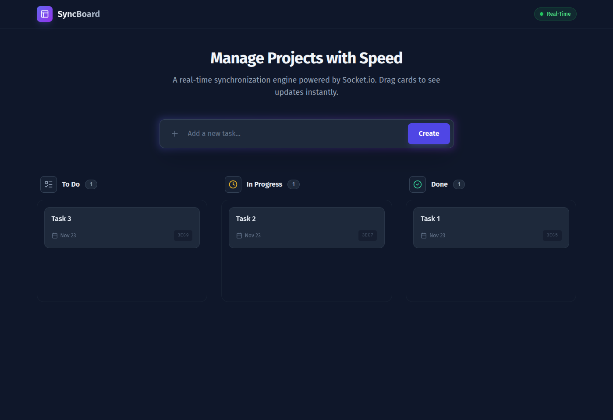

# SyncBoard ⚡

**SyncBoard** is a real-time collaborative task manager (Trello Clone).

I built this project to understand how **WebSockets** work in production. Unlike standard REST apps where you need to refresh the page to see changes, SyncBoard pushes updates instantly to all connected clients using **Socket.io**. It features a glassmorphism UI and a robust drag-and-drop interface.

🔴 **[View Live Demo](https://sync-board-k8wv5hcrq-jerish-js-projects.vercel.app/)**  
*(Note: The backend is hosted on Render's free tier. Please wait ~50 seconds for the server to wake up on the first load!)*

---

## 🔥 Features that matter

*   **Real-Time Synchronization:** I used the Observer pattern with **Socket.io**. If User A drags a card, User B sees it move instantly (sub-100ms latency).
*   **Optimistic UI:** The interface updates immediately when you drop a card, even before the server responds. If the request fails, it rolls back automatically.
*   **Persistent Data:** All tasks and states are stored in **MongoDB Atlas**.
*   **Drag & Drop:** Built using `@hello-pangea/dnd` for smooth, touch-friendly interactions.
*   **Modern Design:** Fully responsive layout with Glassmorphism effects using **Tailwind CSS**.

---

## 🛠️ Tech Stack

*   **Frontend:** React (Vite), Tailwind CSS, Axios, Lucide Icons.
*   **Backend:** Node.js, Express.js.
*   **Database:** MongoDB (Mongoose).
*   **Real-Time Engine:** Socket.io (WebSockets).

---
